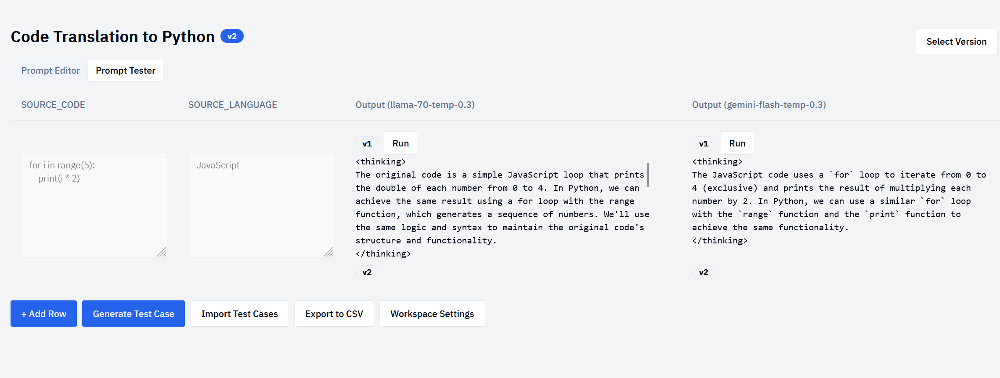

# evalite

Poor man's LLM eval platform. 




## Features

- MIT license
- Autogenerate prompts from task description
- Autogenerate test cases from prompt
- Run test cases against multiple LLM versions / sampling strategies

Future:

- Streaming output 
- Latency statistics
- Multimodal input
- Human rate test cases
- Auto LLM grade test cases 

## Usage

We use [hermit](https://cashapp.github.io/hermit/) to manage dependencies.

Run the dev servers:

```bash
go run cmd/serverd/main.go 
cd frontend && bun run dev
```

The go server must be able to load env vars corresponding to your LLM provider API keys. This can be via a .env file or via the environment.

If the keys are found, the server will automatically load support for the LLM provider and make it available to the frontend.

Production is an exercise left to the reader.